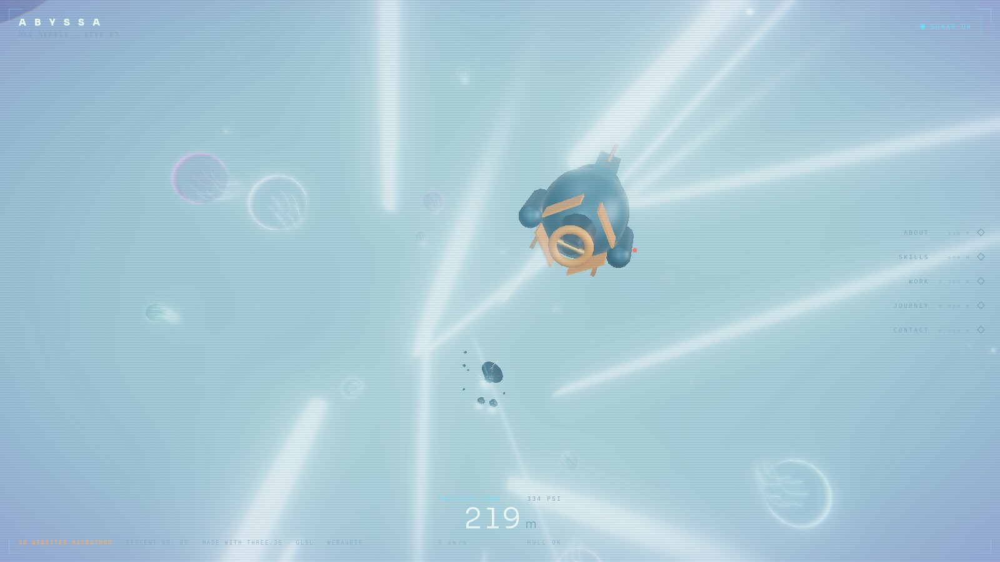

# 🌊 ABYSSA — one scroll to the bottom of the ocean

**Live:** https://yashwanth07-debug.github.io/abyssa/
**Demo video:** see [`SUBMISSION.md`](SUBMISSION.md#4-demo-video) · **Screenshots:** [`screenshots/`](screenshots/)

> A 3D portfolio disguised as a crewed deep-sea descent. You board the DSV **NEREIS**,
> scroll, and sink **10,935 metres** from sunlit surface water to Challenger Deep —
> past bait balls, jellyfish gardens, a sperm whale, anglerfish, a siphonophore,
> and a smoking hydrothermal vent field. Every zone of the real ocean is a section
> of the site.



---

## The idea

Portfolios usually scroll *down* a page. ABYSSA makes that literal: **scroll = depth**.
The depth readout is the scrollbar (per-zone auto-dock on release), pressure and
temperature recomputed in real time, and the whole ocean — colors, fog, life,
light — is a continuous function of how far you have scrolled.

### The descent

| Depth | Zone | Section | Resident |
|---|---|---|---|
| 0–200 m | Epipelagic · *Sunlight* | Hero | god rays, bubbles |
| ~110 m | — | **About** | a shimmering bait ball of 220 fish |
| ~600 m | Mesopelagic · *Twilight* | **Skills** | jellyfish garden, the whale overhead |
| ~2,200 m | Bathypelagic · *Midnight* | **Work** | anglerfish hunting by lure-light |
| ~5,000 m | Abyssopelagic | **Journey** | a 40 m siphonophore drifting past |
| ~8,200 m | Hadal · *Trenches* | **Contact** | hydrothermal ridge, black-smoker chimneys |
| 10,935 m | Challenger Deep | Outro | the vent field in your headlight pool |

Everything is procedural — no textures, no models, no video. The ocean is code.

## Inspiration

- Real oceanography: the five pelagic zones, Challenger Deep (10,935 m), the
  snailfish depth record (8,336 m), whale-song propagation, marine snow, and
  black-smoker vents all appear in the HUD copy and the world.
- The scroll-driven cinematic websites of the Awwwards era — especially
  *sebastien-lempens.com*-style full-scene 3D journeys — pushed into a medium
  nobody scrolls: going **down**.
- Submarine films (*Das Boot*, *The Abyss*) for sound and pacing: sonar pings,
  hull creaks, and a depth-pressure rumble synthesized live in WebAudio.

## Highlights

- **Custom GLSL throughout** — animated water dome with depth-graded sky,
  shader-driven bait-ball shimmer, whale + siphonophore vertex skinning,
  jellyfish bells with additive fresnel, vent-smoke sprite systems.
- **Depth-driven everything** — fog color/density, water palette, light,
  pressure/temp/PSI readouts and audio mix all read the same scroll scalar.
- **Zone auto-dock camera** — release the scroll and the sub glides into a
  docked viewing position for each section; the panels ride a CSS 3D tilt.
- **Sonar ping** (toggle in HUD) — a raycast pulse that reveals creatures
  nearby in a ring, with a synthesized ping and echo.
- **Procedural WebAudio** — sonar, whale song, sonar-threat sweep, hull groans
  at hadal depth. Best with sound on.
- **Zero external assets** — fonts self-hosted screenshots aside, the entire
  world is generated at runtime.

## Technologies & tools

Three.js (WebGL2) · custom GLSL shaders · Vite · plain ES modules ·
WebAudio API (sonar/whale synthesis) · CSS 3D transforms for the HUD & panels.
Built with TypeScript-free vanilla JS on purpose — one `npm run build`.

## Run it

```bash
npm install
npm run dev      # local dev
npm run build    # → dist/ (deployed to GitHub Pages)
```

## Controls

- **Scroll** — descend. Keep scrolling; pressure only makes things more interesting.
- **Release** — auto-dock at the current zone station.
- **Sonar toggle** — ping the water column around you.
- **Free look** (outro) — inside the vent field, drag to look around.

## About

Built by **Yashwanth K.** for the **3D Websites Hackathon** (Jul 25 – Sep 2, 2026).
Third in an informal trilogy of full-scene 3D journeys — after a sky voyage and an
interplanetary flight, this one goes the other way: down.

MIT licensed — see [LICENSE](LICENSE).
